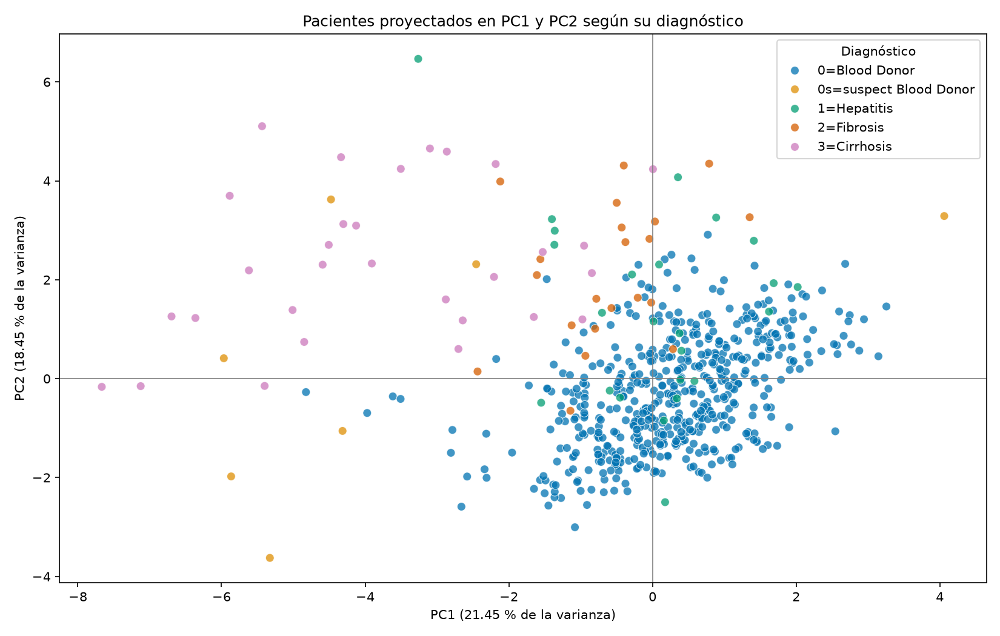

# Análisis de Datos — Evento Evaluativo 2

**Instituto Tecnológico Metropolitano (ITM)**

Departamento de Sistemas · Ingeniería de Sistemas

Curso: Análisis de Datos · Docente: Daniel Alexis Nieto Mora · Semestre 2026-2

## Integrantes

| Integrante | Usuario en Git |
|---|---|
| Julián | JulianHZ711 |
| Santiago | ExBlake |
| Oscar Alexis | AlexisPineda21 |
| Jacobo | JCobz0714 |

## Objetivo

Aplicar lo visto en las primeras semanas del curso en un proyecto práctico: explorar tres bases de datos, justificar la elección de una, hacerle un análisis exploratorio completo (EDA) y prepararla con técnicas de preprocesamiento y reducción de dimensionalidad (PCA).

## Datasets explorados

| Dataset | Tipo de datos | Resumen |
|---|---|---|
| HCV Data | Tabular (datos clínicos) | 615 pacientes con edad, sexo, diagnóstico y 10 resultados de laboratorio |
| Absenteeism at Work | Tabular con componente temporal | 740 registros de ausentismo de 36 empleados de una empresa |
| Ajwa or Medjool | Imágenes y tabular | 200 imágenes y características de 20 dátiles de dos variedades |

Las tres bases vienen del UCI Machine Learning Repository. Los enlaces y la documentación de cada una están en el notebook 01.

## Dataset seleccionado

Elegimos **HCV Data**. Lo comparamos con las otras dos bases usando nueve criterios (completitud, documentación, relevancia, manejabilidad, tamaño, calidad de variables, facilidad para el EDA, preprocesamiento y reducción de dimensionalidad) y obtuvo 43 de 45 puntos. Tiene pocos faltantes, buena documentación, variables clínicas continuas y un diagnóstico que sirve para comparar grupos y para colorear el PCA.

## Estructura del repositorio

```text
Analisis-de-datos-evento-2/
├── README.md
├── requirements.txt
├── .gitignore
├── data/
│   ├── raw/          # datos originales
│   └── processed/    # hcv_processed.csv, resultado del preprocesamiento
├── notebooks/
│   ├── 01_exploracion_datasets.ipynb       # Fase 1: comparación y selección
│   ├── 02_eda_hcv.ipynb                    # Fase 2: EDA
│   └── 03_preprocesamiento_reduccion.ipynb # Fase 3: preprocesamiento y PCA
└── images/           # gráficas exportadas
```

## Tecnologías

Python, pandas, NumPy, Matplotlib, seaborn, SciPy, scikit-learn y Jupyter.

## Instalación

```bash
git clone https://github.com/ExBlake/Analisis-de-datos-evento-2.git
cd Analisis-de-datos-evento-2
python -m venv venv
# Windows
venv\Scripts\activate
# Linux / macOS
source venv/bin/activate
pip install -r requirements.txt
```

## Ejecución

```bash
jupyter notebook
```

Abrir los notebooks de la carpeta `notebooks/` en orden (01 → 02 → 03) y ejecutarlos completos. Las rutas de los datos son relativas a esa carpeta.

## Metodología

1. **Notebook 01:** documentación de las tres bases, comparación con tabla de criterios y selección de HCV Data.
2. **Notebook 02:** estructura y clasificación de variables, calidad de los datos, estadística descriptiva, distribuciones y valores atípicos, análisis bivariado y multivariado, pruebas de hipótesis e insights.
3. **Notebook 03:** tratamiento de faltantes, transformación logarítmica, One-Hot Encoding, escalado con StandardScaler y PCA.

## Principales resultados

- **Desbalance:** 533 de los 615 registros son donantes sanos (86.67 %).
- **Faltantes:** 31 celdas vacías en 26 filas; `ALP` concentra 18, todas de pacientes. No hay duplicados.
- **Atípicos:** la mayoría son de pacientes (por ejemplo, 51 de los 64 atípicos de `AST`), así que se conservaron. Se encontró un error de digitación en el registro 217 (`ALB` mayor que `PROT`).
- **Correlaciones:** las más fuertes son `ALB–PROT` (Pearson 0.557) y `AST–GGT` (0.491).
- **Hipótesis:** se confirmaron las diferencias de `AST` y `ALB` entre donantes y pacientes y la correlación `ALB–PROT`; la asociación entre sexo y diagnóstico no fue significativa (p = 0.0673).
- **PCA:** PC1 explica el 21.45 % y PC2 el 18.45 % de la varianza (39.90 % juntas). Con 7 componentes se conserva el 84.32 %.



## Conclusiones

- HCV Data permitió aplicar todo el proceso visto en el curso: calidad de datos, estadística descriptiva, relaciones entre variables, pruebas de hipótesis, preprocesamiento y PCA.
- Los marcadores de laboratorio cambian claramente entre donantes y pacientes, sobre todo en cirrosis, y eso se confirmó con las pruebas de hipótesis y con el PCA.
- Los valores atípicos no se eliminaron porque en su mayoría son valores reales de pacientes.
- El PCA con dos componentes sirve para visualizar, pero deja por fuera el 60.10 % de la varianza. Para un modelo convendría usar 7 componentes.
- Limitaciones: la imputación usó el diagnóstico de cada paciente. El error de `ALB` del registro 217 se pasó a faltante y se imputó en el preprocesamiento.

## Entregables

- Este repositorio con los tres notebooks, los datos y las gráficas.
- Video explicativo de máximo 8 minutos.
